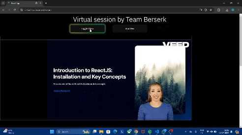

# Virtual Teacher



## Introduction

The "Virtual Teacher" project aims to revolutionize the education sector by creating AI-powered virtual teachers that can deliver online instruction through both synchronous and asynchronous sessions. This innovative tool leverages cutting-edge technologies to create interactive and engaging learning environments, making education more accessible and tailored to individual needs.

## Key Features

- **Personalized Instruction**: Tailors lessons and feedback to individual student needs, learning pace, and preferences.
- **Scalability**: Capable of handling a large number of students simultaneously, providing high-quality education regardless of geographic or socio-economic barriers.
- **Interactive Learning**: Utilizes advanced platforms and tools to create engaging learning experiences.

## Technologies Used

- **React**: For developing dynamic and interactive user interfaces.
- **TensorFlow/Keras**: For implementing AI functionalities and machine learning models.
- **Express.js**: For efficient communication between client-side applications and server-side models.
- **TensorFlow.js or MediaPipe**: For enabling interactive control and real-time feedback.

## Installation and Setup

1. Clone the repository:
    ```bash
    git clone https://github.com/your-username/virtual-teacher.git
    cd virtual-teacher
    ```

2. Install the dependencies:
    ```bash
    npm install
    ```

3. Start the development server:
    ```bash
    npm start
    ```

## Usage

1. Open your browser and navigate to `http://localhost:3000`.
2. Follow the on-screen instructions to interact with the virtual teacher.

## Project Structure

- `src/`: Contains the source code for the React application.
- `public/`: Public assets and HTML template.
- `server/`: Server-side code using Express.js.

## Future Scope

The virtual teacher is expected to further enhance traditional education through blended learning models, making quality education more accessible and effective globally. Future developments will focus on improving AI capabilities, expanding interactive features, and addressing current challenges such as internet accessibility and student motivation.

## Contributors

- Omkar Unde
- Deepak Singh
- Aditya Jadhav

## Acknowledgments

We would like to thank our guide, Prof. Kavita Jadhav, and the Department of Computer Science and Engineering at PCET-NMVPM’s Nutan College of Engineering and Research, Talegaon, Pune, for their support and guidance.
